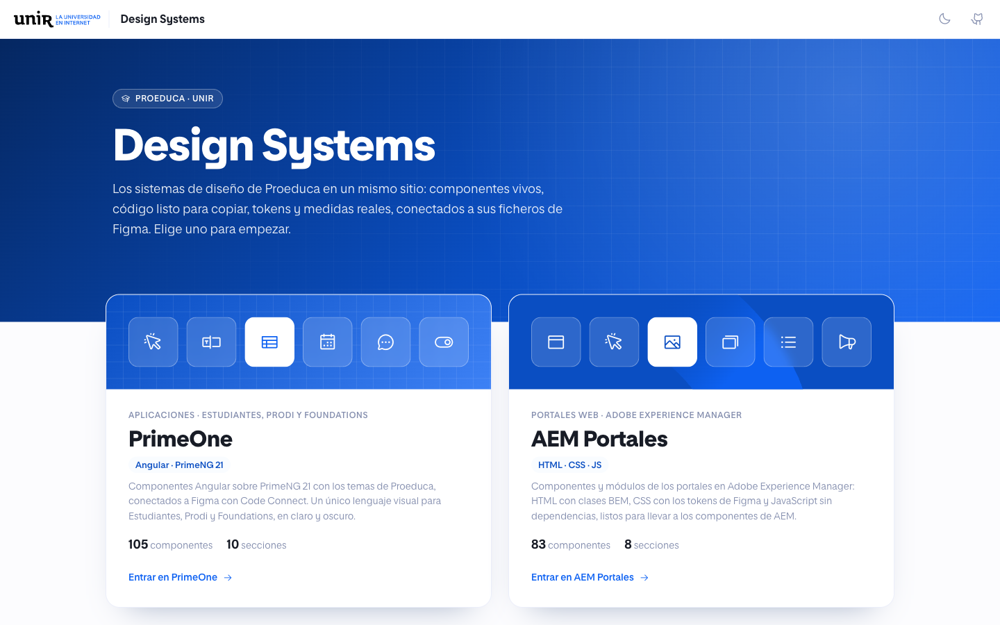
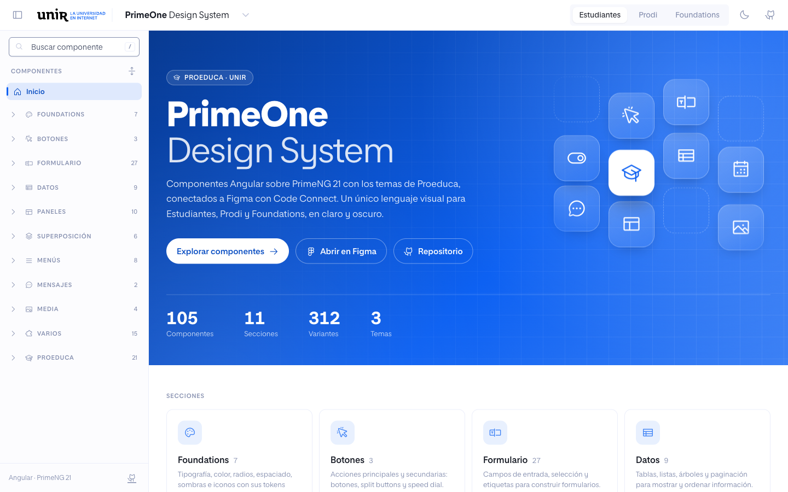
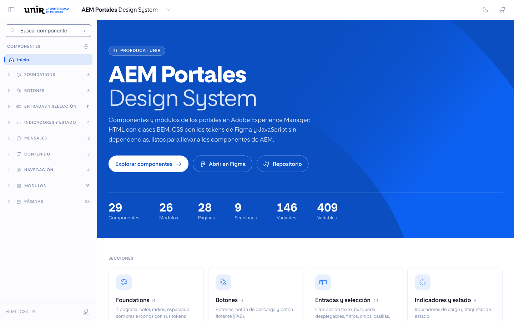

# UNIR Design Systems

Librería Angular del design system PrimeOne: componentes PrimeNG 21 (licencia MIT) con los presets del DS y componentes propios de Proeduca (`prime-one-*`), conectados a Figma con Code Connect.

## Capturas

Explorador de los sistemas de diseño (`npm run explorer`).



| PrimeOne | AEM Portales |
| --- | --- |
|  |  |

| Sección | Componente |
| --- | --- |
|  |  |


## Requisitos

- Node.js `^20.19.0`, `^22.12.0` o `>=24` (requisito de Angular 21)
- `npm install`

## Comandos

| Comando | Qué hace |
| --- | --- |
| `npm run build` | Compila la librería en `dist/prime-one-ds` (ng-packagr) |
| `npm run storybook` | Navegable de componentes en `http://localhost:6006` |
| `npm run build-storybook` | Genera el navegable estático en `storybook-static/` |
| `npm run explorer` | Explorador del DS (catálogo, componente en vivo y panel de control) en `http://localhost:4300` |
| `npm run build-explorer` | Genera el explorador estático en `dist/explorer/browser` |
| `npm run figma:parse` | Valida las plantillas de Code Connect sin publicar |
| `npm run figma:publish` | Publica Code Connect en Figma (requiere token) |

## Uso

```ts
import { providePrimeNG } from 'primeng/config';
import { PrimeOneEstudiantes } from 'prime-one-ds';

providePrimeNG({ theme: { preset: PrimeOneEstudiantes, options: { darkModeSelector: '.po-dark' } } });
```

Presets disponibles: `PrimeOneEstudiantes`, `PrimeOneProdi`, `PrimeOneFoundations`. El modo oscuro se activa con la clase `po-dark` en `<html>`. Los iconos son de Phosphor (`@phosphor-icons/web`): los componentes usan los pesos regular, bold y fill, así que la app debe cargar `src/regular/style.css`, `src/bold/style.css` y `src/fill/style.css`.

La tipografía es Proeduca Sans (`src/fonts/`, pesos 200 a 800 con cursivas). El explorador y Storybook la cargan desde `src/fonts/proeduca-sans.css`; una app que use el DS debe incluir ese CSS en sus `styles`. Los presets publican la escala tipográfica de Figma (`--p-typography-headline-h1-size`, `--p-typography-body-m-line-height`, `--p-typography-weight-semibold`...) y la de espaciado (`--p-scale-1` = `1rem`) como variables CSS globales.

`p-editor` no se reexporta desde `prime-one-ds`: PrimeNG carga `quill` bajo demanda y quien lo use debe instalarlo (`npm install quill`).

## AEM Portales

El mismo paquete incluye el sistema de diseño de los portales en Adobe Experience Manager ([Figma](https://www.figma.com/design/hT9BgF8wE5lXM54ldUcy9H/Design-System---AEM-Portales)), sin framework: HTML con clases BEM, CSS y JavaScript sin dependencias.

- `src/aem/styles/tokens.css`: las variables de Figma como variables CSS `--aem-*` (core, semantic y responsive size: móvil por defecto, tablet desde 768px y escritorio desde 1280px), sombras y degradados.
- `src/aem/styles/typography.css`: los estilos de texto de Figma como clases (`.aem-headline-2`, `.aem-body`, `.aem-label-1`...).
- `src/aem/styles/field.css` y `menu.css`: la caja compartida de los campos (etiqueta flotante, validación, deshabilitado) y el menú de opciones de desplegables, filtros, buscador y calendario.
- `src/aem/styles/page.css` y `src/aem/pages/`: las plantillas de página (Figma «Pages · Templates · Design System · AEM») montadas con los módulos: las 20 del portal (Home, fichas, facultad, área, revista, actualidad, eventos, profesores, opiniones, becas, FAQs...) y las landings (Distributiva, Producto, Comparativa, Derivativa, Eventos, Formularios, Cookies y Error 404). Las imágenes están en `src/aem/pages/images`.
- `src/aem/styles/brand.css`: el azul de marca con la curva de los portales (`.aem-brand`), el logo de UNIR y los marcadores de imagen y logo.
- `src/aem/components/<componente>/`: el CSS de cada componente, su JavaScript cuando tiene comportamiento y su story con el HTML. Componentes: Button, Download Button, Floating Button; Chip, Checkbox, Radio Button, Toggle, Input Text, Text Area, Search, Dropdown, Filter, Date Picker, Slider; Progress Spinner, Tag, Tag Set, Date Tag; Notification, Ticker; Accordion, Avatar, Card, Data Table, List; Anchor Menu, Breadcrumb, Pagination, Tabs. Módulos de página: Section, Navigation Header, Hero, Hero Home, Accelerator, Key Data, Distribution Bar, Distributor, Card Block, Banner, Content Block, Image Gallery, Logo Gallery, Featured Data, Featured Text, Filter Module, Comparison Block, List Block, Accordion Block, Testimonial, Form, Modal, Share Banner, Sticky Button, Thank You y Footer.
- `src/aem/aem.js`: `initAem()` da comportamiento a todos los componentes de la página (acordeón, pestañas, desplegables y filtros, buscador, calendario, slider, chips, paginación, menú de anclas, contador del área de texto, carruseles, megamenú de la cabecera, acordeón del pie en móvil, modal y copiar enlace) sin dependencias. Se puede llamar de nuevo tras añadir HTML: cada componente se inicializa una vez.
- Modo oscuro: la clase `aem-dark` en `<html>` o en un contenedor lleva los tokens semánticos a sus valores inverse de Figma (los de las variantes On-Inverse); `--inverse` los fuerza en una sección oscura de una página clara.

Una página de AEM incluye `aem/aem.css` y `aem/aem.js` del paquete (`node_modules/prime-one-ds/aem/`), la fuente Proeduca Sans y los iconos de Phosphor (los del fichero de Figma); las clases se usan directamente en las plantillas HTL y `initAem()` se llama al cargar la página.

## Storybook

Cada componente tiene una story con controles generados desde su API real (inputs de PrimeNG 21 y de los componentes `prime-one-*`). La barra superior permite cambiar de tema (Estudiantes, Prodi, Foundations) y de modo (claro u oscuro). Los eventos aparecen en el panel Actions.

## Explorador

App Angular propia (`explorer/`) para enseñar los sistemas de diseño. Arranca en una home general donde se elige PrimeOne o AEM Portales (el logo vuelve a ella; `?ds=prime-one` o `?ds=aem` abre cada uno). Para cada sistema: navbar con tema (Estudiantes, Prodi, Foundations) y modo claro u oscuro, catálogo a la izquierda, el componente real en el centro y el panel de control a la derecha (las dos columnas laterales se pliegan). En AEM, la sección Páginas enseña cada plantilla en sus breakpoints de Figma (1920, 1280, 768 y 375, escalada para caber), con su HTML y a pantalla completa; las que tienen varios estados (Eventos antes, durante y después; Formularios; Cookies; Error 404) los eligen en la barra. Los enlaces, botones y cards de una plantilla abren la plantilla correspondiente (`explorer/src/app/frame/page-links.ts`). Cada componente muestra sus variantes, todas sus propiedades, el registro de eventos y el código listo para copiar (HTML y TypeScript) con los valores actuales.

- Arranca en una home (hero con las cifras del DS y las secciones del catálogo). Cada sección tiene una vista general con una ficha visual por componente (`?s=Form`); el componente se abre con `?c=<id>`. Atrás y adelante del navegador funcionan entre páginas. Iconos y resúmenes de las fichas en `explorer/src/app/catalog-meta.ts`.
- Foundations (`?s=foundations`) es una sección más: ficha en la home y grupo en el catálogo con un acceso a cada apartado. Muestra los tokens reales del tema y modo activos, leídos de las variables CSS: tipografía (familia, pesos y la escala de estilos de Figma con `--p-typography-*`), paletas de color (primario, superficie y severidades), tokens semánticos (texto, contenido, resaltado, campos, acciones negativas, foco), radios primitivos y por rol, espaciado (`--p-scale-*`), sombras e iconos. Pulsar un token copia su `var()`.
- El componente se renderiza en un iframe con el ancho del dispositivo elegido (escritorio, tablet o móvil), así que sus media queries responden como en un dispositivo real.
- La propia app es responsive: por debajo de 1024px el catálogo y el panel de control pasan a paneles que se abren desde el navbar.
- El dispositivo sigue a la ventana: por debajo de 1024px la vista pasa a tablet y por debajo de 768px a móvil, con el tema en un desplegable. Se puede cambiar a mano hasta el siguiente salto de ancho.
- El panel de código tiene cuatro pestañas: HTML, TypeScript (CSS y, si lo hay, JS en AEM), Tokens y Medidas. Medidas dibuja las cotas sobre el componente real (tamaño, padding, tamaño de cada hijo y gaps, atravesando envoltorios) y, al pasar el ratón por cualquier elemento anidado, su tamaño y sus distancias a los bordes y muestra la caja del elemento elegido como en Figma (margen, borde, radios, padding, contenido, layout y tipografía), en tiempo real. Tokens lista las variables del DS que usa el componente renderizado (nombre al estilo Figma, `stepper/step/number/active/background`, variable CSS y valor en el tema y modo activos), con filtro y copia.
- Usa las stories como fuente única (`src/components/**/*.stories.ts`); `scripts/generate-explorer-index.mjs` genera el índice al arrancar o compilar.
- Las plantillas de las stories se compilan en el navegador (JIT). Por eso la build de producción no optimiza los scripts: esa optimización elimina los metadatos de los NgModules (`FormsModule`, `TableModule`...) que el compilador necesita.

## Code Connect

Las plantillas están junto a cada componente (`src/components/**/*.figma.ts`) y usan los helpers de `src/figma/`. Para publicarlas en el fichero de Figma del DS:

```bash
FIGMA_ACCESS_TOKEN=<token con permiso Code Connect> npm run figma:publish
```

AEM Portales tiene su propia configuración (`figma.aem.config.json`, etiqueta «AEM (HTML)») y sus plantillas junto a cada componente y módulo (`src/aem/components/**/*.figma.ts`, helpers en `src/figma/aem.ts`). Los módulos reutilizan el `render` de su story, así el código de Figma es el mismo HTML que enseña el explorador:

```bash
FIGMA_ACCESS_TOKEN=<token con permiso Code Connect> npm run figma:publish:aem
```

El token necesita los scopes *Code Connect: Write* y *File content: Read* y acceso al fichero del DS. No lo guardes en el repositorio.

## Skills

`skills/` reúne skills para Claude y Codex que trabajan con Figma y el sistema de diseño: auditoría de librerías, generación de componentes, documentación, sincronización de tokens, Figma a código, `DESIGN.md` para Open Design y arquitectura de variables. La tabla de lo que hace cada una y cómo instalarlas está en [skills/README.md](skills/README.md).

## Agente

[`AGENTS.md`](AGENTS.md) da a Claude Code, Codex y cualquier agente que lea ese fichero el contexto de los dos sistemas de diseño: dónde está cada cosa, cómo se hace un componente en cada uno, cómo se verifica en el explorador y cómo se publica Code Connect. `CLAUDE.md` solo lo importa (`@AGENTS.md`) para que Claude Code lo cargue aunque haya otro `CLAUDE.md` por encima del repo. Cómo se carga, qué sabe, cómo trabaja y cómo mantenerlo: [docs/agente.md](docs/agente.md).
