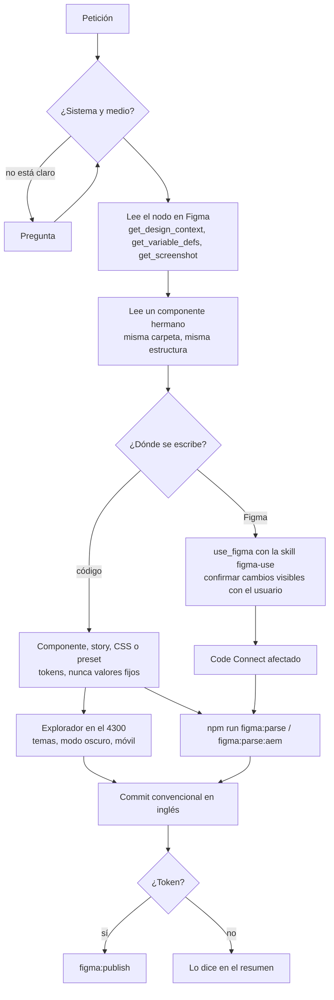

# El agente del repositorio

[`AGENTS.md`](../AGENTS.md), en la raíz, convierte a cualquier agente de código que abra este repositorio (Claude Code, Codex u otro que lea ese fichero) en un especialista en los dos sistemas de diseño: PrimeOne y AEM Portales. No es un programa ni un subagente aparte: son las instrucciones que el agente carga al empezar cada sesión y que le dicen cómo está hecho el repo, de dónde sale la verdad visual (Figma) y qué tiene que comprobar antes de dar algo por terminado.

## Cómo se carga

### Claude Code

Claude Code lee `AGENTS.md` por sí mismo (desde la versión 2.1.277), pero solo cuando no hay ningún `CLAUDE.md` en la carpeta de trabajo ni en las de arriba. Como es habitual tener uno en el home, el repo lleva un `CLAUDE.md` de una línea, `@AGENTS.md`, que importa el fichero en todos los casos. Las instrucciones propias de Claude, si algún día hacen falta, van debajo de esa línea.

Comprobación: `/context` dentro de la sesión lista `AGENTS.md` bajo **Memory files**. Alternativa sin `CLAUDE.md`: en `/config`, poner **Project instructions** en `claude-md-and-agents-md`.

### Codex

Codex lee `AGENTS.md` desde la raíz del repo hasta la carpeta actual (antes, `~/.codex/AGENTS.md` si existe), los concatena y para al llegar a 32 KiB (`project_doc_max_bytes`). No hay que configurar nada.

Comprobación: `codex exec "Resume las instrucciones del proyecto"` debe hablar de PrimeOne y AEM Portales.

### Otros agentes

Cualquier herramienta que lea `AGENTS.md` (Cursor, Gemini CLI, Copilot...) obtiene lo mismo. Las skills de [`skills/`](../skills/README.md) se pueden leer y seguir sin instalarlas; para que el agente las active solo cuando la petición encaje, instálalas como explica su README.

## Qué sabe

- **Mapa del repo:** dónde vive cada cosa (componentes, presets, helpers de Code Connect, estilos AEM, páginas, explorador, skills, informes).
- **Los dos sistemas:** ficheros de Figma, stack, tokens (`--p-*` y `--aem-*`), temas, modo oscuro (`po-dark` y `aem-dark`), breakpoints, título de las stories, etiquetas de Code Connect.
- **Cómo se hace un componente PrimeOne:** reexport de PrimeNG o componente `prime-one-*`, estilos en el preset, story con `bind`, Code Connect con los helpers, PrimeNG fijado por debajo de la 22.
- **Cómo se hace un componente AEM:** carpeta con CSS BEM, tokens siempre, JS `init*` idempotente registrado en `aem.js`, story que devuelve el HTML real, páginas montadas con los módulos.
- **El explorador:** las stories son la única fuente, el índice se genera solo, el iframe necesita el servidor en el 4300, la ficha sale de `catalog-meta.ts`.
- **Figma:** naming de la librería, scopes de las primitivas, técnicas de la Plugin API, la desincronización silenciosa del MCP y las convenciones de las landings.
- **Code Connect:** validar, publicar, el token, los lotes de AEM.
- **Qué skill usar** para auditar, generar componentes, documentar, sincronizar tokens, pasar de Figma a código o diseñar variables.
- **Cuándo está terminado** un cambio.

## Cómo trabaja

El orden importa: Figma antes que el código, el hermano antes que el componente nuevo, el explorador antes que el commit. Si falta una pieza (MCP, servidor, token), el agente sigue con lo que puede y lo dice en lugar de inventar.

## Qué necesita

| Necesidad | Para qué | Si falta |
| --- | --- | --- |
| MCP de Figma conectado en el agente | Leer nodos, variables y capturas; escribir en Figma | Trabaja solo con código y avisa de que no ha contrastado con Figma |
| `npm install` y `npm run explorer` | Verificar el componente en el navegador | No puede comprobar el resultado y lo dice |
| `FIGMA_ACCESS_TOKEN` en el entorno | Publicar Code Connect | Valida con `figma:parse` y deja la publicación pendiente |
| Publicar la librería en Figma | Que los cambios en la librería lleguen a los ficheros que la usan | Es una acción del usuario; el agente lo recuerda al cerrar |

## Ejemplos de peticiones

| Petición | Qué hace el agente |
| --- | --- |
| «Crea el componente Ticker de AEM a partir del nodo 9322:64892» | Lee el nodo, copia la estructura de `src/aem/components/notification`, escribe CSS con `--aem-*`, story con `figmaNode`, lo añade a `aem.css` y a `AEM_META`, lo mira en el explorador y hace el Code Connect |
| «Audita la librería PrimeOne y genera el informe» | Sigue `skills/component-audit/SKILL.md`, guarda `reports/figma-audit/<fecha>-primeone.md` y `.html` |
| «La card de PrimeOne en Prodi tiene el radio mal» | Compara con las variables de Figma, corrige el rol de radio en `src/theme/presets.ts`, comprueba los tres temas |
| «Monta la landing de becas en Figma, desktop, tablet y móvil» | Usa el fichero de páginas y las convenciones de landings (formulario lateral fijo, acelerador azul, versiones al lado), confirma cambios visibles contigo |
| «Publica el Code Connect de los módulos AEM que he cambiado» | Valida con `figma:parse:aem` y publica por lotes de unos seis ficheros con `-f` |

## Cómo mantenerlo

- Es parte del código: cuando cambie una convención (una carpeta, un helper, un flujo), cambia `AGENTS.md` en el mismo commit.
- Cabe en menos de 200 líneas y 32 KiB. Por encima, Codex lo corta y Claude pierde adherencia. Si crece, mueve el detalle a una skill o a un documento en `docs/` y deja aquí el enlace.
- Solo lo que no se deduce del código: convenciones, razones y trampas. Los comandos los da `package.json` y las rutas el propio árbol; se citan para situar, no para duplicar.
- Cuando una corrección se repita en varias sesiones, conviértela en una línea del fichero.
- Las rutas y los `npm run` que cita se comprueban con `ls` y `package.json`; una referencia rota enseña al agente a desconfiar del resto.
