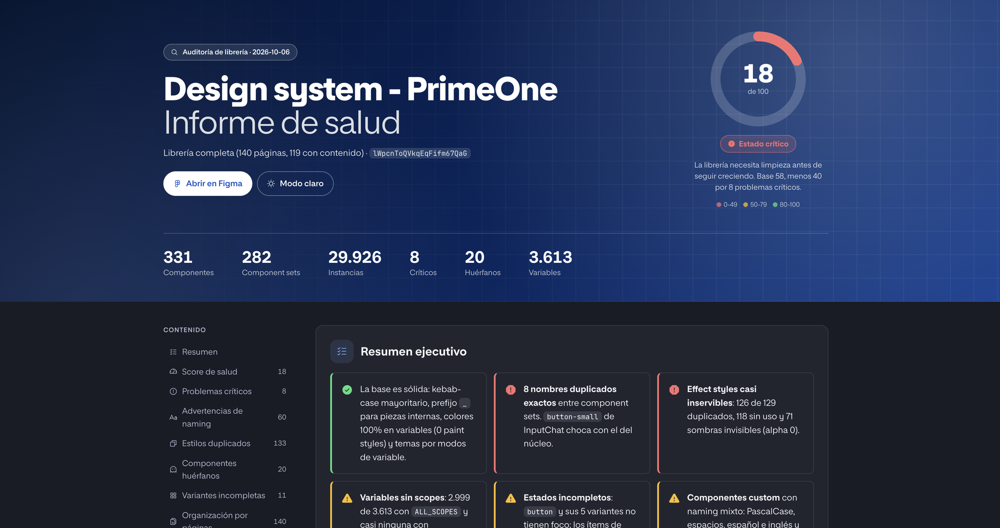

# Skills de sistemas de diseño

Skills para agentes de código (Claude y Codex) que trabajan con Figma y con el sistema de diseño. Cada carpeta es una skill con su `SKILL.md`; el agente la activa sola cuando la petición encaja con su descripción.

| Skill | Qué hace |
| --- | --- |
| [`component-audit`](component-audit/SKILL.md) | Audita una librería de Figma: componentes huérfanos, naming inconsistente, variantes que faltan, estilos duplicados o sin usar, y un informe de salud del sistema en Markdown y en HTML visual. |
| [`component-generator`](component-generator/SKILL.md) | Crea componentes en Figma desde una descripción, un JSON de tokens o la guía de estilo, con sus variantes y estados y conectados a las variables del sistema. |
| [`design-system-docs`](design-system-docs/SKILL.md) | Genera la documentación del sistema desde Figma (uso de cada componente, especificaciones, guía de estilo) y la exporta a Notion, Storybook o MDX. |
| [`design-tokens-sync`](design-tokens-sync/SKILL.md) | Exporta e importa tokens entre Figma y código (JSON, Style Dictionary, W3C DTCG), compara versiones y los mantiene sincronizados con el repositorio. |
| [`figma-to-code`](figma-to-code/SKILL.md) | Convierte componentes de Figma en código listo para producción (React, Vue, HTML/CSS), con props desde las variantes, tokens como variables y Code Connect. |
| [`figma-to-open-design`](figma-to-open-design/SKILL.md) | Convierte un fichero o componente de Figma en un `DESIGN.md` portable compatible con Open Design, para que cualquier agente use el sistema. |
| [`variable-architect`](variable-architect/SKILL.md) | Diseña la arquitectura de variables de Figma: colecciones, modos claro/oscuro o multimarca, aliases, carga desde tokens JSON y migración de estilos a variables. |

Las skills que leen o escriben en Figma necesitan el servidor MCP de Figma conectado en el agente.

### Informe de `component-audit`

Además del Markdown, `component-audit` genera un informe HTML con la plantilla [`report-template.html`](component-audit/report-template.html): score de salud con su estado (crítico, mejorable o saludable), resumen, problemas por gravedad, tablas con ids de Figma y recomendaciones, en modo claro y oscuro. Ejemplo: [auditoría de PrimeOne](../reports/figma-audit/2026-10-06-primeone.html).



## Instalación en Claude

### Claude Code

Para todos tus proyectos, copia las carpetas a `~/.claude/skills/`:

```bash
mkdir -p ~/.claude/skills
for s in skills/*/; do cp -R "${s%/}" ~/.claude/skills/; done
```

Solo para un proyecto, cópialas a `.claude/skills/` en la raíz de ese proyecto. Reinicia la sesión de Claude Code para que las cargue.

### Claude (web y escritorio)

Comprime la carpeta de cada skill en un `.zip` y súbelo desde los ajustes de Skills de Claude:

```bash
cd skills && for s in */; do zip -qr "${s%/}.zip" "$s"; done
```

## Instalación en Codex

Para todos tus proyectos, copia las carpetas a `~/.agents/skills/`:

```bash
mkdir -p ~/.agents/skills
for s in skills/*/; do cp -R "${s%/}" ~/.agents/skills/; done
```

Solo para un repositorio, cópialas a `.agents/skills/` en la raíz de ese repositorio. Codex las carga al arrancar en esa carpeta ([documentación de skills de Codex](https://developers.openai.com/codex/skills)).
